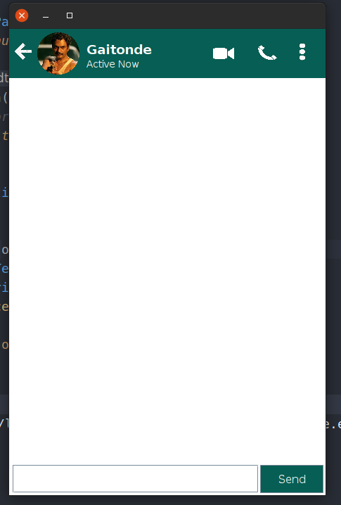
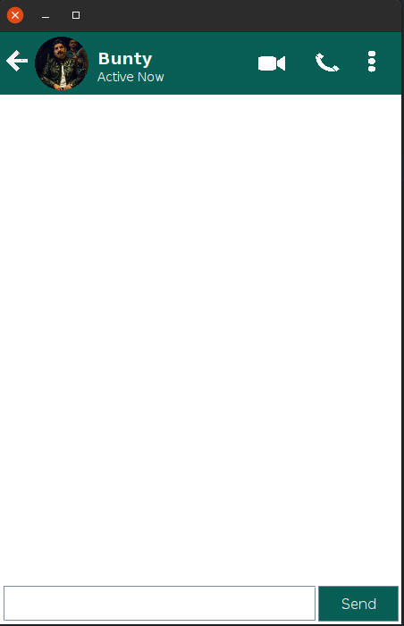
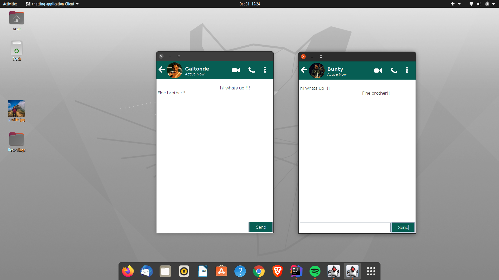

# Chatting Application using Socket.io

## Steps to run application:-
<ul>
    <li> Open src/chatting/application directory </li>
    <li> First run Server.java file</li>
</ul>

`$ javac Server.java`  
`$ java Server`

<ul>
    <li> Now Run Client.java file</li>
</ul>

`$ javac Client.java`  
`$ java Client`

**Your Application is now ready you can start interacting with each other!!**
 
 

